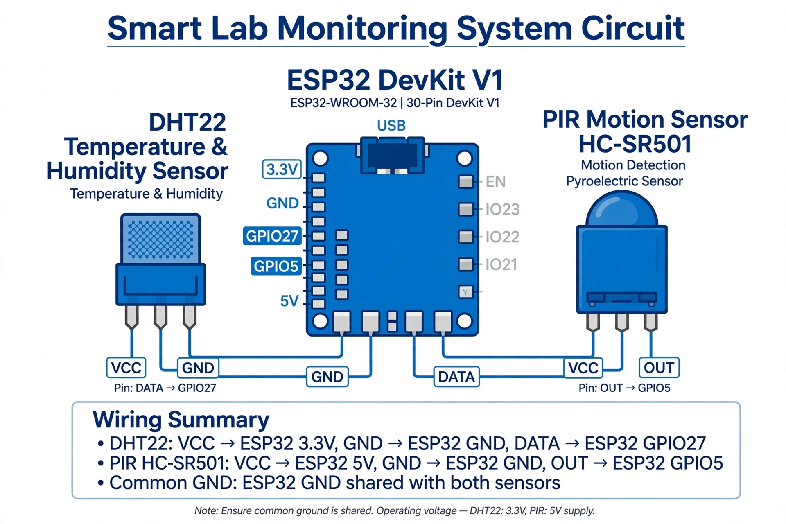

# Smart Lab Monitoring System - IoT Project

IoT based system to monitor lab temperature, humidity and motion using ESP32.

### Components Used
- ESP32 DevKit V1
- DHT22 Sensor (Temperature & Humidity)
- PIR Motion Sensor HC-SR501
- Wokwi Simulator

### Features
- Real-time Temperature & Humidity Monitoring
- Motion Detection Alert
- Serial Monitor Output

### Live Simulation Link
https://wokwi.com/projects/473577630874233857

### Circuit Diagram

!## Simulation Output

### How to Run
1. Open Wokwi link
2. Press PLAY button
3. Check Serial Monitor for output

Created by Tanvi Katkar | 2026
